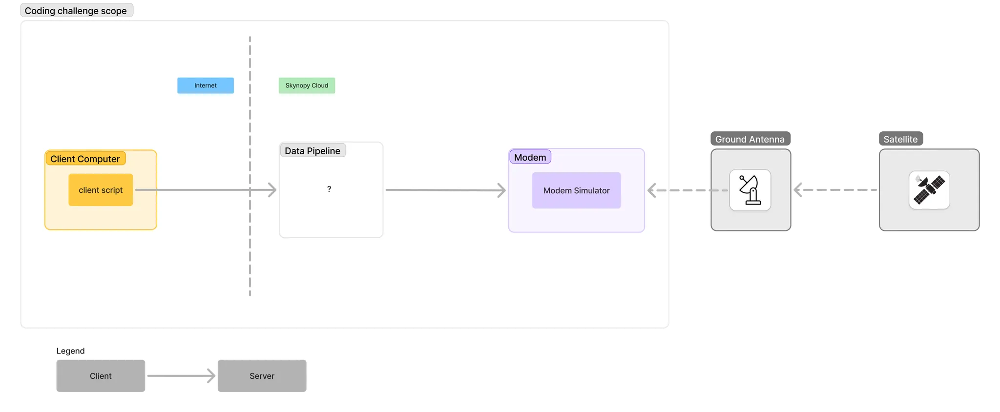

## Introduction

A Python-based simulation of ground station communication with satellite systems, handling telemetry, telecommands, and modem metrics.

## System Architecture

### Modem

Modules:

- **Telemetry Server**: Send telemetries using TCP socket port 8000
- **Telecommands Server**: Receive telecommands using TCP socket port 8001

- **Modem API Endpoints**:
  - `GET /metrics/status`
  - `GET /metrics/signal_strength`
  - `GET /metrics/bit_error_rate`
  - `GET /metrics/statistics`

### Client with Redis

Modules:

- **Telemetry Server**: Receive telemetries using redis connection
- **Telecommands Server**: Send telecommands using redis connection
